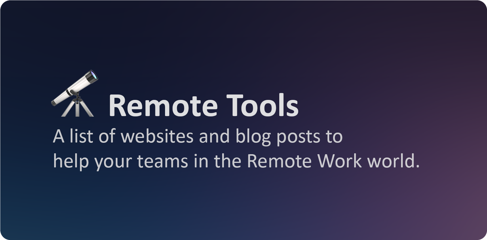

# 🔭 Productive tools for remote teams

- [🏢 Virtual Offices](#-virtual-offices) Tools to be connected the most part of the time and have virtual experience with your team.
- [📞 Chat and Call](#-chat-and-call) Use professional tools instead personal apps to communicate with the team.
- [⛳ Project and Team Management](#-project-and-team-management) Manage the project and the capacity or billing of your team.
- [🃏 Estimations](#-estimations) Estimate the projects with the best experience with your teammates.
- [💻 Pair programming](#-pair-programming) Pair programming is not only screenshare, use this tools to improve your productivity.
- [🚥 Retrospectives](#-retrospectives) Allow the remote team, as a group, to evaluate its past working cycle.
- [🏂🏼 Team Building](#-team-building) Improve your team interactions and communication with something fun.
- [🔮 Remote Jobs](#-remote-jobs) List made by experts of Remote Jobs aggregtors and websites.
- [📒 Tags and information](#-tags-and-information) There are some tags to describe how this tool can help to your team.

### 🏢 Virtual Offices

Tools to be connected the most part of the time and have  virtual experience with your team.

| Url and description | Thumbnail | Tags |                                                                                                     
|:--------------------|-----------|------|
| **[Discord](https://discord.com)** A place that makes it easy to talk every day and hang out more often. |</img>|[🆓](#-tags-and-information)[📞](#-chat-and-call)
| **[Gather](https://gather.town)** Centered around fully customizable spaces, Gather makes spending time with your communities just as easy as real life. |</img>|[🆓💳](#-tags-and-information)[📞](#-chat-and-call)[🏂](#-team-building) 
| **[Discord as a Virtual Office](https://debbie.codes/blog/discord-virtual-office)** Blog post by Debbie O'Bryan about use Discord as a Virtual Office. |</img>|[✍](#-tags-and-information)

### 📞 Chat and Call

Use professional tools instead personal apps to communicate with the team.

| Url and description | Thumbnail | Tags |                                                                                                     
|:--------------------|-----------|------|
| **[Slack](https://slack.com)** It's the digital HQ for everyone you work with—even people at other companies. |</img>|[🆓💳](#-tags-and-information)|
| **[Teams](https://www.microsoft.com/microsoft-teams)** Meet, chat, call, and collaborate in just one place. |</img>|[🆓💳](#-tags-and-information)|
| **[Zoom](https://zoom.us)** Keeping you securely connected wherever you are. |</img>|[🆓💳](#-tags-and-information)|

### ⛳ Project and Team Management

Manage the project and the capacity or billing of your team.

| Url and description | Thumbnail | Tags |                                                                                                     
|:--------------------|-----------|------|
| **[Azure Devops](https://azure.microsoft.com/services/devops/)** Plan smarter, collaborate better, and ship faster with a set of modern dev services. |</img>|[🆓💳](#-tags-and-information)
| **[Jira](https://www.atlassian.com/software/jira)** The best software teams ship early and often. |</img>|[🆓💳](#-tags-and-information)
| **[Monday](https://monday.com)** Easily build, run, and scale your dream workflows on one platform. |</img>|[🆓💳](#-tags-and-information)
| **[Officevibe](https://officevibe.com)** A single platform to engage with your team members and cultivate trust. Tackle challenges and build strengths so your team can do its best work. |</img>|[💳](#-tags-and-information)

### 🃏 Estimations

Estimate the projects with the best experience with your teammates.

| Url and description | Thumbnail | Tags |                                                                                                     
|:--------------------|-----------|------|
| **[Scrumpy](https://scrumpypoker.com)** Online planning poker application for distributed agile teams with optional Jira/Confluence /Slack/GitHub/GitLab integration. |</img>|[🆓](#-tags-and-information)

### 💻 Pair programming

Pair programming is not only screenshare, use this tools to improve your productivity.

| Url and description | Thumbnail | Tags |                                                                                                     
|:--------------------|-----------|------|
| **[Code Anywhere](https://codeanywhere.com)** Saves you time by deploying a development environment in seconds, enabling you to code, learn, build, and collaborate on your projects.. |</img>|[🆓💳](#-tags-and-information)
| **[Live Share](https://marketplace.visualstudio.com/items?itemName=MS-vsliveshare.vsliveshare)** Enables you to collaboratively edit and debug with others in real time, regardless what programming languages you're using or app types you're building. |</img>|[🆓](#-tags-and-information)
| **[Paircast](https://paircast.io)** Identify great candidates by watching how they solve problems on video. No meetings required. |</img>|[🆓](#-tags-and-information)
| **[Teletype](https://teletype.atom.io)** Lets developers share their workspace with team members and collaborate on code in real time. |</img>|[🆓](#-tags-and-information)

### 🚥 Retrospectives

Allow the remote team, as a group, to evaluate its past working cycle.

| Url and description | Thumbnail | Tags |                                                                                                     
|:--------------------|-----------|------|
| **[Easy Retro](https://easyretro.io/)** Collaborate with your remote team and get better at what you do with a simple, intuitive and beautiful tool. |</img>|[🆓💳](#-tags-and-information)
| **[Miro](https://miro.com/)** Collaborate with your remote team and get better at what you do with a simple, intuitive and beautiful toolThe online collaborative whiteboard platform to bring teams together, anytime, anywhere. |</img>|[🆓💳](#-tags-and-information)
| **[Mural](https://mural.co/)** Discover digital-first visual collaboration with MURAL. More than an online whiteboard, where everyone contributes equally and hard problems are solved faster. |</img>|[🆓💳](#-tags-and-information)
| **[Retrium](https://retrium.com/)** Enables agile teams to have effective conversations, discover new insights, and generate action plans. |</img>|[💳](#-tags-and-information)

### 🏂 Team Building

Improve your team interactions and communication with something fun.

| Url and description | Thumbnail | Tags |                                                                                                     
|:--------------------|-----------|------|
| **[Among Us](https://www.innersloth.com/games/among-us/)** A party game of teamwork and betrayal. Crewmates work together to complete tasks before one or more Impostors can kill everyone aboard. |</img>|[🆓💳](#-tags-and-information)
| **[Kahoot](https://kahoot.com)** Make learning awesome! Delivers engaging learning to billions. |</img>|[🆓](#-tags-and-information)
| **[Among Us Team building guide](https://www.bulb.digital/blog/the-ultimate-guide-to-playing-among-us-as-a-team-building-or-breaking-exercise)** Blog post by Mitch Herrema about how to play Among Us to improve your team building. |</img>|[✍](#-tags-and-information)

### 🔮 Remote Jobs

List made by experts of Remote Jobs aggregtors and websites.

| Url and description | Thumbnail |                                                                                                 
|:--------------------|-----------|
| **[Remote ES](https://github.com/remote-es/remotes)** A repository listing companies which offer full-time remote jobs with Spanish contracts. |</img>
| **[Remote Jobs List](https://github.com/PatrickJS/remote-jobs-list)** Simply a list of companies or jobs boards advertising Remote Jobs. |</img>
| **[Wakkos Remote Jobs](https://github.com/Wakkos/RemoteJobs)** A list of remote jobs aggregators by [Wakkos](https://twitter.com/wakkos). |</img>

# 📒 Tags and information
There are some tags to describe how this tool can help to your team.
- 🆓 The tool is totally free.
- 💳 You have to pay to use this tool.
- ✍🏻 A blog post interesting to learn about the tools of this category.

If a tool could fit in more than one category, it will have the icon of the category as a tag.

Example:
| Url and description | Thumbnail | Tags |                                                                                                     
|:--------------------|-----------|------|
| **[Lorem](https://lipsum.com)** A tool to generate Lorem ipsum texts |</img>|[🆓🤗](#-tags-and-information)[🏢](#-virtual-offices)

---
Made with 🍕 by [Quique Fdez Guerra](https://twitter.com/ckgrafico)

